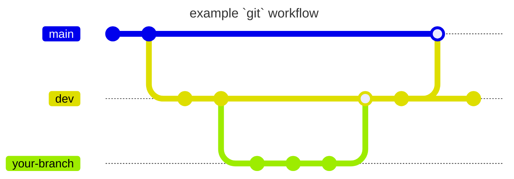

---
last_update:
    author: Carlos Valdez
    date: April 19 2024
description: Read up on the Ojos Project policies for git and GitHub!
---

# git Policies

[`git`](https://git-scm.org/) is a fantastic tool that helps developers manage
their source code. [GitHub](https://github.com/) is a tool that helps
developers manage their many git repositories.

This document will outline how we will use `git` in the Ojos Project.

## `git`

### Commits

Commit messages are similar to emails. I often like to use `git commit` instead of
`git commit -m "your message"` so that I can properly make it feel like an
email. Overall, think of it this way:

The first line is the subject line of an email. The middle section is the body
of the email.

Some commit messages can be long and detailed, [like this](https://github.com/ojosproject/website/commit/f447261bc1c373559350a89821067fc24b33ca16):

```plaintext
feat(index): hover over member generates a background color

This is done so that we can indicate to the user that the member
is clickable, and when they click the member, they are taken
to that members' requested website.
```

... or sometimes they can be short. [Like this](https://github.com/ojosproject/website/commit/6e22e43096f71f3590638b320bfa0e40552368ae):

```plaintext
feat(config): clicking edit this page opens github.dev
```

I won't go into commit conventions here, but
[this article covers it perfectly](https://www.freecodecamp.org/news/how-to-write-commit-messages-maintainers-will-like/).

:::tip

Short messages can be written using `git commit -m "your message"`.

Long commits can be written in two ways. `git commit` opens an editor, OR you can use `git commit -m "subject line" -m "description"` to write a longer commit message.

:::

### Branching

Here's a short table explaining how we will use `git` branching:

| Branch           | Description                                                                                     | Will be merged into |
| ---------------- | ----------------------------------------------------------------------------------------------- | ------------------- |
| `main`           | This is the branch that should always be stable.                                                | None                |
| `dev`            | This is the branch that Ojos developers add their changes to and test. **Main working branch.** | `main`              |
| Any other branch | A feature branch. If you can't push into `dev` or are using a forked branch, use this.          | `dev`               |

A general guideline is:

- Nobody pushes to `main`, it can only be merged into
- Push to `dev` only if it's a quick feature/fix
- Push to your custom branch if it's something that will take a while to finish
  (i.e., won't be finished in a single sitting) and then merge it into `dev`

<!-- ? This uses Mermaid syntax. Learn more here: -->
<!-- ? https://mermaid.js.org/syntax/gitgraph -->



### Identity

Before committing, you should make sure your identity has been set. Please use
your name and email associated with the Ojos Project. Often, this is the email
associated with your educational institution. If I wanted to set my identity, I
would use:

```shell
git config --global user.name "Carlos Valdez"
git config --global user.email "cvaldezh@uci.edu"
```

All identities must be structured the same. That is, preferred first name,
preferred last name, and your educational institution email address. There must
only be one identity per individual too. That is, if I run the command below,
you must only have one identity (line) for yourself.

```shell
git log | grep "Author: " | sort -u
```

If that is not the case, a
[`.mailmap`](https://ntietz.com/blog/git-mailmap-for-name-changes/) file will be
created to map your identities to each other.

### `git` Credit

Sometimes, you will need to commit for other individuals. There's two ways of
doing that.

You can add them as co-authors by having your commit message be:

```shell
your original message


Co-authored-by: Carlos Valdez <cvaldezh@uci.edu>
```

Another method is by changing the author for one commit by using this command:

```shell
git commit --author="Carlos Valdez <cvaldezh@uci.edu>"
```

## GitHub

:::warning

We're transitioning from GitLab to GitHub. Some of this information may be
outdated.

:::

### Issues & Pull Requests

Both Issues and Pull Requests are features that help us stay organized in
GitHub. However, something to keep in mind about these is that they are used to
reference one another. Issues can very likely be referenced back in the future,
so please behave appropriately in them.

### Closing an Issue

To close an issue, please make sure you write something like "Fixed in
`commit hash`". That way, we can reference individuals to where the fix was made
so that, if in the future we need to reference it, we can.

### Push Limits

Pushing into the `main` branch will almost always be strictly forbidden unless
you were given permission to do so. In fact, GitHub won't allow you to push into
`main`. In order to get your changes in `main`, you must push/merge into `dev`.
We will open raise a Pull Request from `dev` to `main`.
