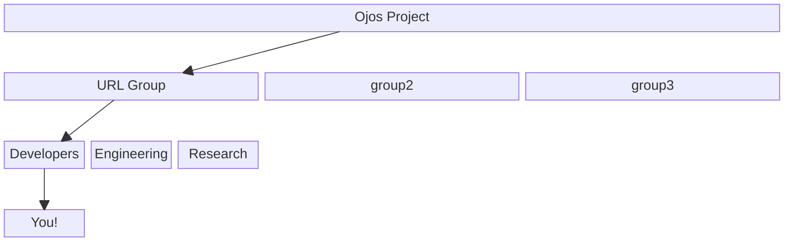

# Groups, Teams, and Members

We throw around terms such as 'group', 'team', 'member', etc. This will
hopefully help clarify the structure of the Ojos Project to make sure things
don't get complicated as time moves on.

This example above represents [the URL Group](/url/).

## Ojos Project

At the very top, there is the Ojos Project as an organization.

## Groups

A "group" in the Ojos Project is a group that is dedicated towards a specific
project. The URL Group, for example, is focused on building the hospice device.

Every group will have a Group Lead, in charge of making sure the project is
moving forward.

In these groups, there are teams. Read more below.

## Teams

Teams are, well, a group inside of a group. They're working on the same project
the rest of the group is, except they work on a specialized aspect of it.

For example, the URL Group is working on building a hospice device. However,
the URL Group has a Developers team, an Engineering team, and a Research team.
All of them are working on building this device, but they have specialized roles
for their involvement in building the device.

Each team can also have a Team Lead, if they so choose. It is recommended,
though.

## Members

You're considered a member of the Ojos Project if you've officially joined any
group or team. For example, Ayush is part of the Developers team in the Ojos
Project URL group, making him a member of the Ojos Project.

## Who reports to who?

A team member reports to their Team Lead. A Team Lead reports to the Group Lead.
A Group Lead reports to the Ojos Project Lead.

If there is no Team Lead, a member reports directly to the Group Lead.
