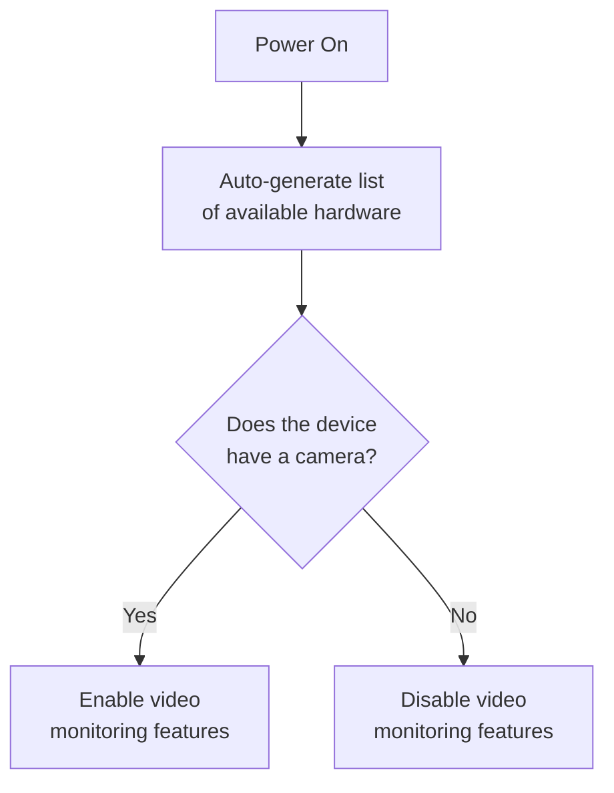

# Any Linux System Proposal

The idea behind "it must run on any Linux system"
for the URL Group is that, this must be installable and runnable on any Linux
system for the sake of being accessible.

## Case Study: ChromeOS Flex

Google offers a version of ChromeOS called
[ChromeOS Flex](https://chromeos.google/products/chromeos-flex/), which is a
version that is meant to be installable on any computer and make it into a
Chromebook.

:::tip

The reason I decided to use ChromeOS as an example is because it is a
[Linux-based operating system](https://en.wikipedia.org/wiki/ChromeOS).

:::

So, a person can get their old computer and install ChromeOS on it by either
fully replacing their existing operating system, or by
[dual booting](https://en.wikipedia.org/wiki/Multi-booting).

## Iris on Any Linux System

The idea behind this is that people would install Linux on their computers, and
they'd be able to install Iris on it so that they would have a DIY hospice
device, making it accessible without them having to purchase anything. That is,
assuming they already had the computer to begin with.

Iris would detect features the computer has, such as a camera, microphone, etc.,
and enable features based on the hardware it detects.

This, in theory, would be a great way to repurpose old devices while also
ensuring that this does not bring an additional financial burden to the family.

## What would users have to do?

If they're using the hospice device we're developing, nothing.

However, if they're using their own device, they'd have to do the following:

1. Get a computer
2. Install a Linux distribution on their computer
3. Install Iris and run setup scripts
4. Start using it!

## What does "detecting hardware" look like?

This is mostly a software issue, but it would look something like the following.
Let's assume Iris wants to activate the video monitoring feature.

It would be something like
[this website](https://www.webrtc-experiment.com/DetectRTC/) that detects what
hardware is available ont he computer.

So, when it comes to the hardware device that
[the Engineering team](/url/engineering/) is developing, the flowchart will
obviously go down the "Yes" path. However, if someone wants to repurpose their
old laptop, or even their own Raspberry Pi, it could go either way.

## Conclusion

Ultimately, because Iris will be open-source and Linux-based,
[there is nothing stopping users from doing this](https://www.youtube.com/watch?v=6KJpy9DRzfY).
Though, the least we can do is help guide those wanting to do this do it in a
fast, efficient, and safe manner.
