# Credit via Git

:::info

This has been put in place. See [the ChaluBot page](/url/research/chalubot).

:::

## What is git credit?

When you go to any git repository, you can run this command:

```shell
git log | grep "Author: " | sort -u
```

... and it will provide you with all the individuals who have participated in
that git repository.

For example, running that command the
[`ojosproject.org` repository](https://gitlab.com/ojosproject/website) brings
up:

```plaintext
Author: Ayush Jain <ayushj4@uci.edu>
Author: Carlos Valdez <cvaldezh@uci.edu>
```

... because Ayush and Carlos are the only individuals who contributed code to
the website. These changes would also be reflected on our git repos in GitHub
and GitLab, such as
[this commit from GitHub](https://github.com/ojosproject/ojos.calejvaldez.com/commit/a909a91aa9b2440b8509748476bd2419fb77be47).
(Notice how it says it is Ayush's work!)

## The Process

I am planning to develop a workflow where the Research team can get git credit
too through the Discord bot. This is how the process would look:

```mermaid
sequenceDiagram
    actor Team Member
    participant Discord Bot
    participant Carlos' Hard Drive
    participant git repo

    Note over Discord Bot: Start here! 🏁

    Discord Bot -->> Team Member: Assigns a research paper
    Team Member -->> Discord Bot: Provides notes
    Discord Bot -->> Carlos' Hard Drive: Sends your notes
    Carlos' Hard Drive -->> git repo: Your changes, with credit
```

<!-- ? This is a sequence diagram using Docusaurus' Mermaid integration. -->
<!-- ? Learn more here: -->
<!-- ? https://docusaurus.io/docs/markdown-features/diagrams -->
<!-- ? https://mermaid.js.org/syntax/sequenceDiagram.html -->



### Commands

Moved to the [ChaluBot page](/url/research/chalubot#commands).

### Are there any privacy concerns?

Your name and email would basically become public, in this format:

```plaintext
Author: FirstName LastName <email@example.com>
```

Though, remember that this information is already available on our website, or
other places of the Ojos Project, so I wouldn't be too concerned. Again, this is
credit so that people who are interested in your work can contact you.
