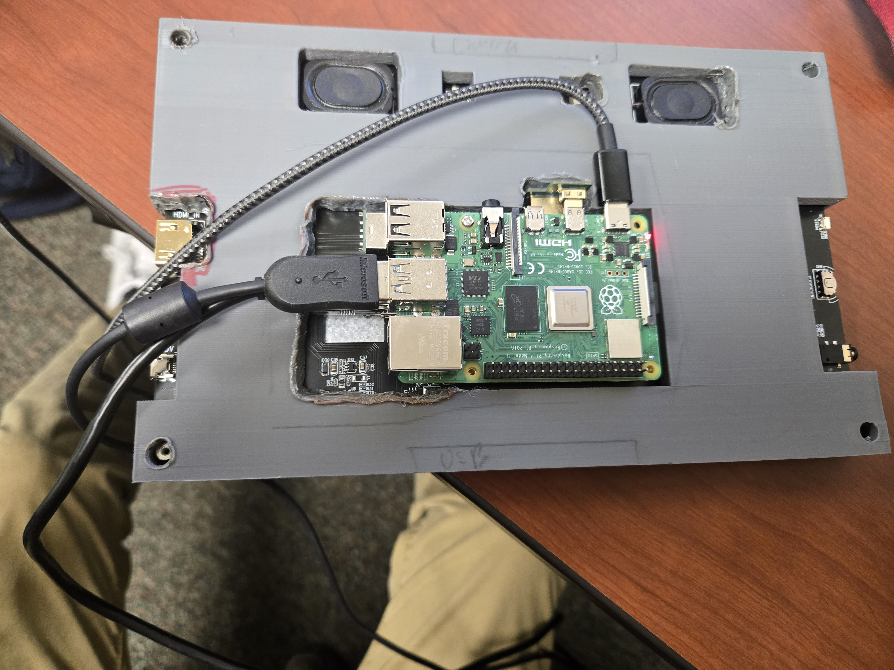
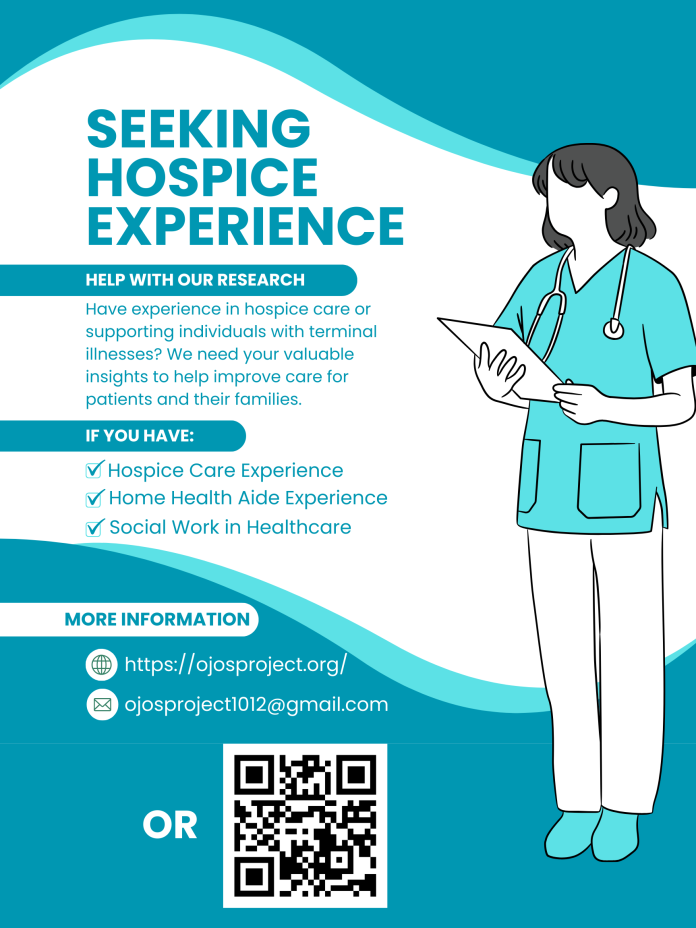

# Fall 2024 Wrap Up

Another quarter in, another quarter out. Let’s talk about what we’ve been doing
in the Ojos Project!

<!-- truncate -->

## Developer Updates

### Software Coming Together

Developers have been hard at work making Iris come together, and although we’re
not yet ready to confirm it as a beta just yet, we have screenshots!

Developers researched the integration for connecting wearables and external devices to Iris. They also researched Twilio to build phone number relaying.

<!-- 

 -->

## Engineering Updates

### Palliaview V0.2 Development

Engineers started by redesigning the monitor shell. The purpose of redesigning the outer shell was to create a case that would better fit onto the monitor and protect and conceal the electronics connected to the rear of the monitor. After redesigning the shell, it was 3D printed and marked for further improvements.

The arm mount was also redesigned this past Fall quarter to create a more stable mount that would support the monitor. It was then 3D printed and inspected for further development.

## Research Updates

Mai Luong conducted interviews to obtain information and insight on the current care caregivers give and patients receive. Mai also created a poster to create more outreach opportunities for the research team.

## General Updates

### CHI 2025 Research Competition

A team was formed for the competition by Engineering Team Leader Joseph Sweatt. Documentation in preparation for the CHI 2025 Research Competition was started. The CHI Competition is
